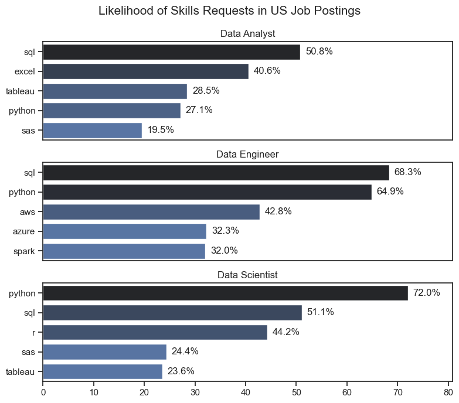
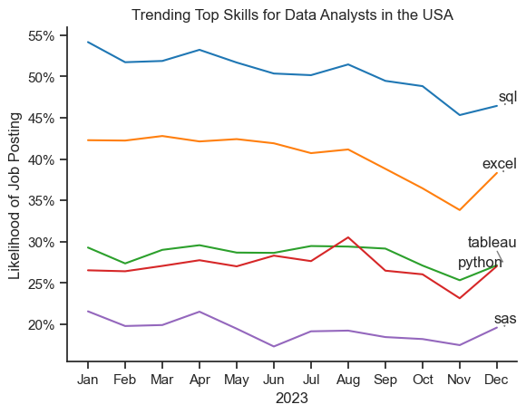
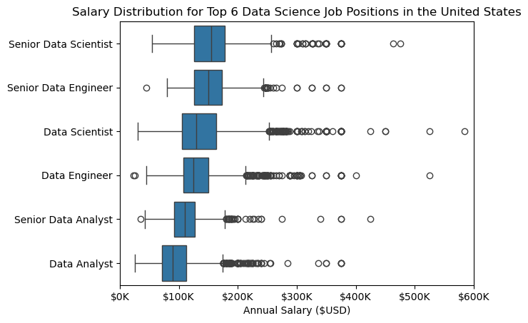
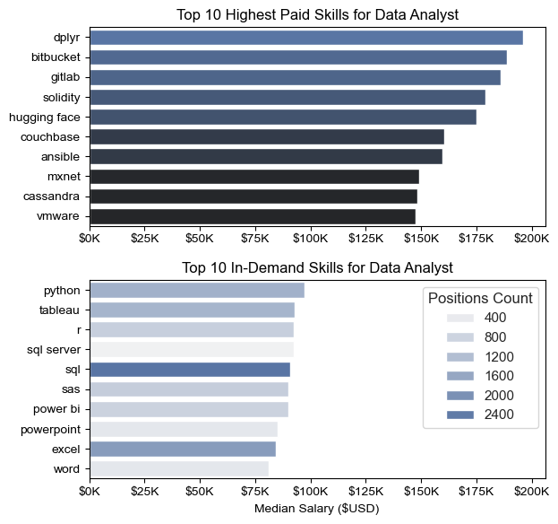
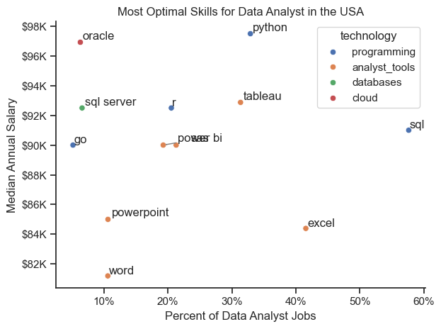

# The Analysis

## 1. What are the 3 most in-demand skills for the top 3 most popular data roles?

To find the most demanded skills for the top 3 most popular data roles. I filtered out those positions by which ones were the most popular, and got the top 5 skills for these top 3 roles. This query highlights the most popular job titles and their top skills, showing which skills I should pay attention to depending on the role I'm targeting.

View my notebook with detailed steps here:
[2_Skill_demand.ipynb](3_Project/2_Skill_demand.ipynb)

### Visualization Data

```python
(fig, ax) = plt.subplots(len(job_titles),1)
sns.set_theme(style="ticks")
fig.set_size_inches((8,7))

max_pct = max(df_us_skills_pct['skill_percent'])
max_pct = min(max_pct+5,100)

for (i,job_title) in enumerate(job_titles):
  df_plot= df_us_skills_pct[df_us_skills_pct['job_title_short'] == job_title].head(5)
  sns.barplot(data=df_plot, y='job_skills', x='skill_percent',ax=ax[i], hue='skill_percent', palette="dark:b_r")

  for (n,v) in enumerate(df_plot["skill_percent"]):
    ax[i].text(v+1, n, f"{v:.1f}%", va="center")

  ax[i].set_title(job_title)
  ax[i].set_ylabel("")
  ax[i].set_xlabel("")
  #ax[i].legend().set_visible(False)
  ax[i].get_legend().remove()
  ax[i].set_xlim(0,max_pct)
  if i < len(job_titles) - 1:
    ax[i].set_xticks([])

fig.suptitle("Likelihood of Skills Requests in US Job Postings", fontsize=15)
fig.tight_layout()
plt.show()
```

### Results:



### Insights:

- SQL is the most requested skill for Data Analysts and Data Scientists, with it in over half the job postings for both roles. For Data Engineers, Python is the most sought-after skill, appearing in 68% of job postings.
- Data Engineers require more specialized technical skills (AWS, Azure, Spark) compared to Data Analysts and Data Scientists who are expected to be proficient in more general data management and analysis tools (Excel, Tableau).
- Python is a versatile skill, highly demanded across all three roles, but most prominently for Data Scientists (72%) and Data Engineers (65%).

## 2. How are in-demand skills trending for Data Analysts?

### Visualize Data

```python
from adjustText import adjust_text
from matplotlib.ticker import PercentFormatter

df_plot = df_da_us_percent.iloc[:,:5]
sns.set_theme(style="ticks")
sns.lineplot(data=df_plot, dashes=False, palette="tab10", legend=False)
sns.despine()

plt.xlabel('2023')
plt.ylabel('Likelihood of Job Posting')
plt.title("Trending Top Skills for Data Analysts in the USA")

texts = []
for column in df_plot.columns:
  texts.append(plt.text(11.2, df_plot[column].iloc[-1], column))

adjust_text(texts,arrowprops=dict(arrowstyle='->', color='gray', lw=1))

plt.gca().yaxis.set_major_formatter(PercentFormatter(decimals=0))

plt.show()
```

### Results



### Insights:

- SQL remains the most consistently demanded skill throughout the year, although it shows a gradual decrease in demand.
- Excel experienced a significant increase in demand starting around September, surpassing both Python and Tableau by the end of the year.
- Both Python and Tableau show relatively stable demand throughout the year with some fluctuations but remain essential skills for data analysts. Power BI, while less demanded compared to the others, shows a slight upward trend towards the year's end.

## 3. How well do jobs and skills pay for Data Analysts?

### Salary Analysis

### Visualize Data

```python
job_order = df_us_plot.groupby('job_title_short')['salary_year_avg'].median().sort_values(ascending=False).index.to_list()

from matplotlib.ticker import FuncFormatter
sns.boxplot(df_us_top6, x='salary_year_avg', y='job_title_short', order=job_order)
ax = plt.gca()
ax.xaxis.set_major_formatter(FuncFormatter(lambda x,_: f"${int(x/1000)}K"))
plt.xlim((0,600_000))
plt.xlabel('Annual Salary ($USD)')
plt.ylabel("")
plt.title("Salary Distribution for Top 6 Data Science Job Positions in the United States")
plt.show()
```

### Results



### Insights

- There's a significant variation in salary ranges across different job titles. Senior Data Scientist positions tend to have the highest salary potential, with up to $600K, indicating the high value placed on advanced data skills and experience in the industry.
- Senior Data Engineer and Senior Data Scientist roles show a considerable number of outliers on the higher end of the salary spectrum, suggesting that exceptional skills or circumstances can lead to high pay in these roles. In contrast, Data Analyst roles demonstrate more consistency in salary, with fewer outliers.
- The median salaries increase with the seniority and specialization of the roles. Senior roles (Senior Data Scientist, Senior Data Engineer) not only have higher median salaries but also larger differences in typical salaries, reflecting greater variance in compensation as responsibilities increase.

## 4.Highest Paid & Most Demanded Skills for Data Analysts

### Visualize Data

```python
from matplotlib.ticker import FuncFormatter

(fig, ax) = plt.subplots(2,1)
fig.set_figheight(6)

sns.set_theme(style="ticks")

sns.barplot(data=df_us_da_top_pay, x='median_salary', y=df_us_da_top_pay.index, legend=False, ax=ax[0], hue='median_salary', palette="dark:b")
sns.barplot(data=df_us_da_top_demand, x='median_salary', y=df_us_da_top_demand.index, ax=ax[1], hue='job_count', palette="light:b")

ax[0].set_title("Top 10 Highest Paid Skills for Data Analyst")
ax[1].set_title("Top 10 In-Demand Skills for Data Analyst")

xlim = max([axis.get_xlim() for axis in ax])

for axis in ax:
  axis.set_xlim(xlim)
  axis.set_ylabel("")
  axis.xaxis.set_major_formatter(FuncFormatter(lambda x,_: f"${int(x/1000)}K"))
  axis.set_xlabel("")
  #axis.invert_yaxis()
  #axis.legend().set_visible(False)

ax[1].legend(title='Positions Count')
ax[1].set_xlabel("Median Salary ($USD)")

fig.tight_layout()
fig.subplots_adjust()
plt.show()
```

### Results



### Visualize Data:

```python
sns.scatterplot(
  data=df_da_skills_high_demand_tech,
  x='skill_pct',
  y='median_salary',
  hue='technology',
  palette='bright',
  legend='full'
)
```

### Insights:

- The top graph shows specialized technical skills like dplyr, Bitbucket, and Gitlab are associated with higher salaries, some reaching up to $200K, suggesting that advanced technical proficiency can increase earning potential.
- The bottom graph highlights that foundational skills like Excel, PowerPoint, and SQL are the most in-demand, even though they may not offer the highest salaries. This demonstrates the importance of these core skills for employability in data analysis roles.
- There's a clear distinction between the skills that are highest paid and those that are most in-demand. Data analysts aiming to maximize their career potential should consider developing a diverse skill set that includes both high-paying specialized skills and widely demanded foundational skills.

## 5.What are the most optimal skills to learn for Data Analysts?

### Results



### Insights:

- The scatter plot shows that most of the programming skills (colored blue) tend to cluster at higher salary levels compared to other categories, indicating that programming expertise might offer greater salary benefits within the data analytics field.
- The database skills (colored orange), such as Oracle and SQL Server, are associated with some of the highest salaries among data analyst tools. This indicates a significant demand and valuation for data management and manipulation expertise in the industry.
- Analyst tools (colored green), including Tableau and Power BI, are prevalent in job postings and offer competitive salaries, showing that visualization and data analysis software are crucial for current data roles. This category not only has good salaries but is also versatile across different types of data tasks.
